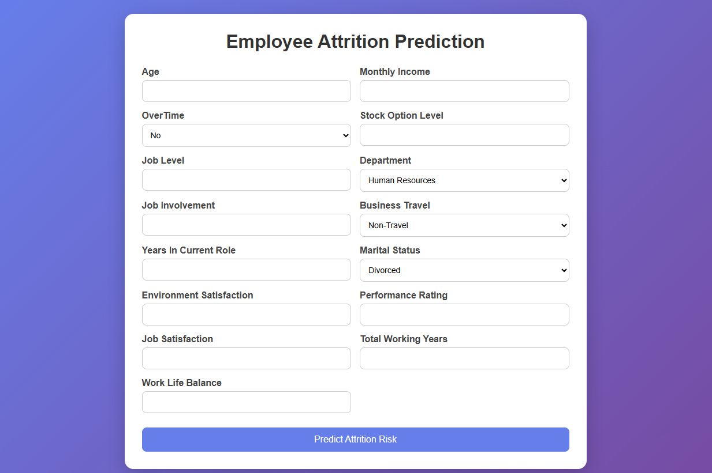
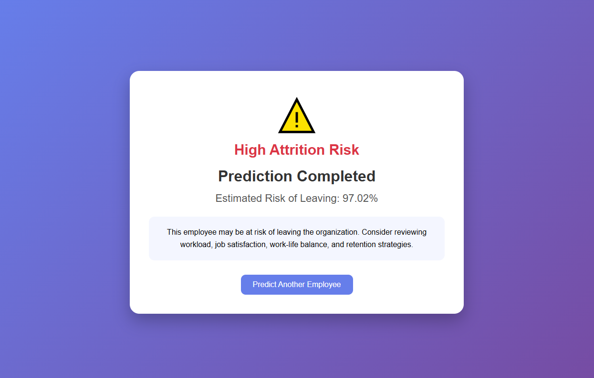

# Employee Attrition Prediction System

## Overview

Employee attrition is a major challenge for organizations as it affects productivity, recruitment costs, and overall business performance. This project aims to predict whether an employee is likely to leave the company using Machine Learning techniques and provides a web-based prediction system built with Flask.

The project includes data preprocessing, exploratory data analysis (EDA), feature selection, model comparison, hyperparameter tuning, class imbalance handling, and deployment.

---

## Project Structure

```text
employee-attrition-prediction/
│
├── README.md
├── requirements.txt
├── Model.ipynb
├── HR-Employee_Attrition.csv
│
└── Project/
    │
    ├── app.py
    ├── best_model2.pkl
    │
    ├── templates/
    │   ├── home.html
    │   └── result.html
    │
    └── screenshots/
        ├── home_page.png
        ├── prediction_result.png
        ├── feature_importance.png
        └── attrition_distribution.png
```

---

## Dataset Information

The dataset contains employee-related information such as:

* Age
* Department
* Business Travel
* Job Level
* Job Satisfaction
* Environment Satisfaction
* Work Life Balance
* Stock Option Level
* Monthly Income
* Years in Current Role
* Performance Rating
* Overtime Status
* Attrition Status

Target Variable:

```text
Attrition
0 → Employee Stays
1 → Employee Leaves
```

---

## Project Workflow

### 1. Data Preprocessing

* Removed irrelevant features:

  * EmployeeCount
  * EmployeeNumber
  * Over18
  * StandardHours
* Checked missing values
* Applied Ordinal Encoding to categorical variables
* Performed Train-Test Split using Stratified Sampling

### 2. Exploratory Data Analysis

Analyzed:

* Attrition Distribution
* Attrition vs Overtime
* Attrition vs Department
* Attrition vs Job Role
* Attrition vs Income
* Attrition vs Age
* Correlation Analysis

### 3. Handling Class Imbalance

The dataset contained approximately a 6:1 class imbalance.

Techniques used:

* Class Weight Balancing
* SMOTE (Synthetic Minority Oversampling Technique)

### 4. Model Building

The following models were evaluated:

* Logistic Regression
* Logistic Regression (Balanced)
* Random Forest
* Random Forest (Balanced)
* XGBoost
* XGBoost + SMOTE

### 5. Hyperparameter Tuning

Used GridSearchCV with:

* Accuracy
* Precision
* Recall
* F1 Score

Model selection was performed using:

```python
refit='f1'
```

---

## Model Performance

### Final Model: XGBoost + SMOTE

| Metric    | Score |
| --------- | ----- |
| Accuracy  | 84.7% |
| Precision | 52%   |
| Recall    | 51%   |
| F1 Score  | 52%   |
| ROC-AUC   | 0.78  |

The XGBoost model trained on SMOTE-resampled data provided the best balance between precision and recall and was selected as the final deployment model.

---

## Feature Selection for Deployment

The full model was trained using all available features.

For deployment, a reduced feature set was used to improve usability while maintaining good predictive performance.

Selected Features:

* OverTime
* StockOptionLevel
* JobLevel
* Department
* JobInvolvement
* BusinessTravel
* YearsInCurrentRole
* MaritalStatus
* EnvironmentSatisfaction
* PerformanceRating
* JobSatisfaction
* TotalWorkingYears
* WorkLifeBalance
* Age
* MonthlyIncome

This reduced-feature model was integrated into the Flask web application.

---

## Key Insights

Feature importance analysis identified the following influential factors:

1. OverTime
2. StockOptionLevel
3. JobLevel
4. Department
5. JobInvolvement
6. BusinessTravel
7. YearsInCurrentRole
8. MaritalStatus
9. EnvironmentSatisfaction
10. PerformanceRating

These findings indicate that workload, employee engagement, career progression, and compensation-related benefits significantly impact attrition risk.

---

## Web Application

The project includes a Flask-based web application where users can:

* Enter employee details
* Predict attrition risk
* View estimated attrition probability
* Receive risk assessment results

### Home Page





### Prediction Result





## Technologies Used

### Programming Languages

* Python

### Libraries

* Pandas
* NumPy
* Matplotlib
* Seaborn
* Scikit-Learn
* XGBoost
* Imbalanced-Learn (SMOTE)
* Joblib

### Deployment

* Flask
* HTML
* CSS

---

## Installation

Clone the repository:

```bash
git clone https://github.com/yourusername/Employee-Attrition-Prediction.git
```

Move to project directory:

```bash
cd Employee-Attrition-Prediction
```

Install dependencies:

```bash
pip install -r requirements.txt
```

Run the application:

```bash
python Project/app.py
```

Open:

```text
http://127.0.0.1:5000
```

---

## Future Improvements

* Deploy on Render or Railway
* Add SHAP explainability
* Add employee retention recommendations
* Improve UI with Bootstrap
* Add database integration

---

## Author

Rohan Verma

M.Tech CSE | Machine Learning | Data Analytics | Python Development

Feel free to connect and provide suggestions for improving the project.
